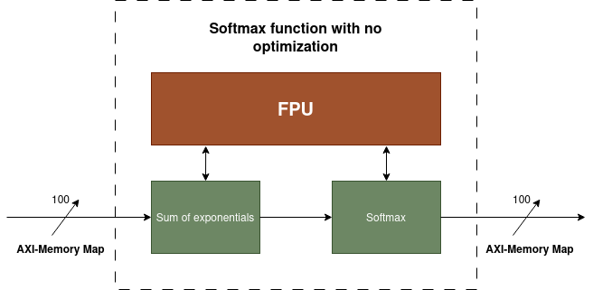
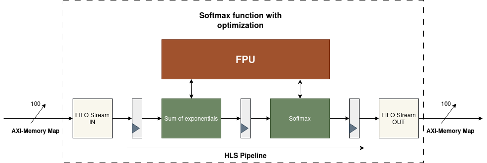

# FPGAs-Proyecto2

https://github.com/isaacfallas/FPGAs-Proyecto2

## Descripción del proyecto

Este repositorio contiene el diseño, implementación y síntesis de dos aceleradores para la función softmax de 100 entradas.

En el primer diseño el objetivo es realizar la codificación sin ninguna directiva (todo por defecto) y el segundo diseño corresponde a una propuesta de optimización del diseño 1.

El objetivo de este proyecto es que sirva como un playground de la síntesis utilizando Vitis HLS de forma que permita conocer sobre los distintos pragmas que este contiene y cómo permiten realizar optimizaciones de diseños de forma más simplificada.

## Explicación de los diseños

### Diseño 1 

El diseño 1 implementa un acelerador de la función softmax de 100 entradas y cumple con las siguientes especificaciones:

* Uso de unidad de punto flotante.
* Número de entradas de 100 elementos.
* Número de salidad de 100 elementos.
* Tanto las entradas como las salidad están dadas en arreglo de 100 como puertos.
* Tanto las entradas como las salidas usan AXI-Memory Map.
* Sintetizable para AMD Kria KV260 a 250 MHz.

La función softmax convierte un vector de N elementos y lo convierte en una distribución de probabilidad proporcional al exponencial de los elementos de entrada. Matemáticamente se define de la siguiente forma:

\[
\sigma(\mathbf{z})_i = \frac{e^{z_i}}{\sum_{j=1}^{K} e^{z_j}}
\]

A nivel de HLS este diseño se realizó la codificación sin ningún directiva.

El diseño lógico de la microarquitectura se presenta a continuación en forma de diagrama de bloques:



Como vemos en el diagrama anterior para implementar la función softmax inicialmente realiza una suma de los exponentes de los números de entrada. Finalizado el cálculo de la suma de exponentes se realiza el cálculo de la función softmax. Ambas etapas utilizan el FPU para poder manejar números en punto flotante.


### Diseño 2

El diseño 2 implementa una optimización del diseño 1 mediante la adición de un pipeline por medio de la directiva HLS Pipeline. Adicionalmente, se le agregan FIFO streams tanto para la entrada como la salida de forma que se pueda tener una pequeña memoria que permita manejar el flujo de los datos de entrada y salida del pipeline implementado.

El diseño lógico de la microarquitectura se presenta a continuación en forma de diagrama de bloques:




 Del diagrama anterior se observa que la principal diferencia con respecto al primer diseño es la adición del pipeline para ejecutar las etapas de suma de exponentes y el softmax de forma concurrente, además de los FIFO streams para poder manejar el flujo de entrada y salida de datos.


## Instrucciones de construcción

### Vitis HLS (Línea de Comandos)
1. Los comandos para Vitis HLS se incluyen en el *script* softmax.tcl:

	- Abre el proyecto
		- Determina la función *top*
		- Agrega los archivos fuente
		- Abre la solución
			- Determina el FPGA objetivo
			- Define la frecuencia de reloj
			- Configura la interfaz (axi), 
		- Ejecuta la síntesis
	- Cierra el proyecto.

2. Abrir el Vitis HLS Command Prompt, o alguna otra consola que corra Vitis HLS.
3. Correr Vitis HLS indicando el *script* softmax.tcl
	- `vitis_hls -f softmax.tcl` ó `vitis_hls softmax.tcl`
		- el modificador `-f` no es necesario en algunas versiones de Vitis.
	- La frecuencia máxima estimada entre los últimos 6 mensajes informativos en la consola.
		- `Estimated Fmax: 342.47 MHz`
4. Revisar los reportes en **solution/syn/report**

## Árbol de archivos con su descripción
```
.
├─ D1/
│  ├─ softmax.cpp             # Softmax Accelerator - Design 1
│  ├─ softmax.h               # Softmax Accelerator Header - Design 1
│  ├─ softmax.tcl             # TCL Script - Design 1
│  └─ softmax_tb.cc           # Softmax Accelerator Testbench - Design 1
├─ D2/
   ├─ softmax.cpp             # Softmax Accelerator - Design 2
   ├─ softmax.h               # Softmax Accelerator Header - Design 2
   ├─ softmax.tcl             # TCL Script - Design 2
   └─ softmax_tb.cc           # Softmax Accelerator Testbench - Design 2

```

## Tabla de comparación de los diseños D1 y D2

| Métrica | Diseño 1 | Diseño 2 | Cambio |
|----------|----------|----------|----------|
| Delay ruta crítica | 2.92ns | 3.35ns | +15% |
| Fmax | 342.47 MHz | 298.78 MHz | -13% |
| Latencia (ciclos) | 1288 | 1135 | -12% |
| Intervalo | 1289 | 1063 | -18% |
| LUT | 5331 | 4992 | -7% |
| FF | 4515 | 5015 | +11% |
| DSP | 9 | 12 | +33% |
| VRAM | 32 | 33 | +3% |

-------

### MP-6166 Diseño Avanzado con FPGAs
### Maestría en Ingeniería Electrónica
### Instituto Tecnológico de Costa Rica
### Profesor Ph. D. León Vega, Luis Gerardo

### Estudiantes

Aguero Villagra, Leonardo Enrique

Cruz Soto, Federico Alonso

Fallas Mejía, Jorge Isaac

Gutiérrez Quesada, Allan Mauricio
